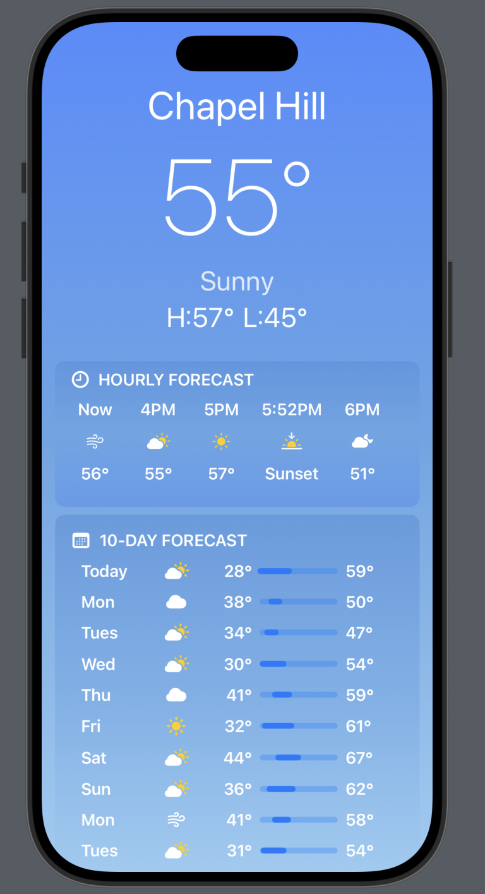

# s25-bootcamp-weatherapp

A modern **SwiftUI-based Weather App** that provides **hourly** and **10-day forecasts** with a sleek UI.  
This project demonstrates the use of **SwiftUI**, **dynamic weather icons**, and **gradient backgrounds** to create a beautiful weather experience.

---

## 🚀 Features

✅ **Current Weather Display** – Shows temperature, conditions, and highs/lows.  
✅ **Hourly Forecast** – Scrollable 24-hour forecast with weather icons.  
✅ **10-Day Forecast** – Extended forecast with temperature trends.  
✅ **Day & Night Mode** – Weather icons adapt based on time of day.  
✅ **Smooth UI & Animations** – Clean SwiftUI design with gradients.